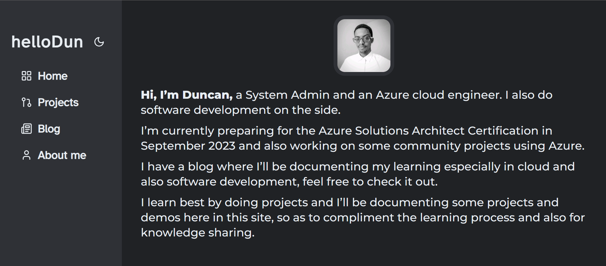

# My personal website | hellodun

Welcome to this repo for my personal website built using Next.js 13! This website showcases some of my projects, blog posts, and more. Feel free to explore the codebase and have a look at the deployed site at [hellodun.com](https://www.hellodun.com).

## Table of Contents

- [My personal website | hellodun](#my-personal-website--hellodun)
  - [Table of Contents](#table-of-contents)
  - [Features](#features)
  - [Screenshots](#screenshots)
    - [About page](#about-page)

## Features

- Projects showcases
- Blog section
- Responsive design with TailwindCSS
- Light & Dark themes in NextJS 13
- NextJS 13 App router

## Screenshots

### About Page

