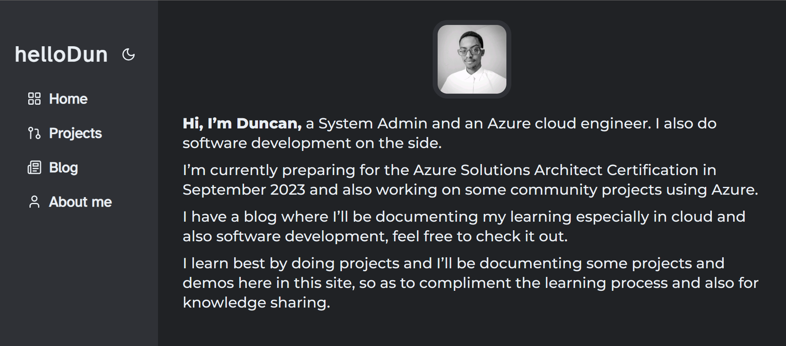

# My personal website | hellodun

Welcome to this repo for my personal website built using Next.js 15 and React 19. This website showcases some of my projects, blog posts, and more. Feel free to explore the codebase and have a look at the deployed site at [hellodun.com](https://duncan-site-six.vercel.app/).

## Table of Contents

- [Features](#features)
- [Tech Stack](#tech-stack)
- [Project Structure](#project-structure)
- [Getting Started](#getting-started)
- [Screenshots](#screenshots)

## Features

- Projects showcase
- Blog section with links to dev.to, Hashnode, and Medium
- Responsive design with Tailwind CSS 4
- Light and dark theme toggle
- Next.js 15 App Router with Turbopack
- Static site generation for all pages

## Tech Stack

- **Framework:** Next.js 15 (App Router)
- **Language:** TypeScript 5
- **UI:** React 19
- **Styling:** Tailwind CSS 4 (CSS-first configuration)
- **Theme:** next-themes (class-based dark mode)
- **Icons:** Lucide React
- **Linting:** ESLint 9 (flat config)

## Project Structure

```
duncan-site/
├── app/                        # Next.js App Router
│   ├── layout.tsx              # Root layout (fonts, theme provider, navigation)
│   ├── page.tsx                # Home page
│   ├── globals.css             # Tailwind CSS config and custom theme colors
│   ├── providers.tsx           # Client-side theme provider
│   ├── about/page.tsx          # About page
│   ├── blogs/page.tsx          # Blog links page
│   └── projects/page.tsx       # Projects page
├── components/                 # Reusable React components
│   ├── Navbar.tsx              # Mobile navigation bar
│   ├── Sidebar.tsx             # Desktop sidebar navigation
│   ├── MobileNav.tsx           # Mobile menu with React state management
│   ├── ThemeButton.tsx         # Dark/light theme toggle
│   ├── Links.tsx               # Centralized navigation and social link data
│   └── FooterNote.tsx          # Footer component
├── lib/                        # Shared utilities
│   └── styles.ts               # Common style constants
├── public/                     # Static assets
│   └── images/profile.jpg      # Profile image
├── next.config.ts              # Next.js configuration
├── eslint.config.mjs           # ESLint 9 flat config
├── postcss.config.js           # PostCSS with Tailwind CSS 4
├── tsconfig.json               # TypeScript configuration
└── package.json                # Dependencies and scripts
```

## Getting Started

### Prerequisites

- [Node.js](https://nodejs.org/) 18.18 or later

### Installation

```bash
# Clone the repository
git clone https://github.com/hellodun/duncan-site.git
cd duncan-site

# Install dependencies
npm install
```

### Development

```bash
# Start the development server (with Turbopack)
npm run dev
```

Open [http://localhost:3000](http://localhost:3000) in your browser.

### Production Build

```bash
# Create an optimized production build
npm run build

# Start the production server
npm start
```

### Linting

```bash
npm run lint
```

## Screenshots

### About Page


